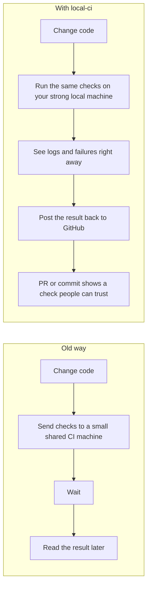

# local-ci-runner

Shared local CI runner for repo-owned verification steps.

`local-ci` exists to run verification where the code actually lives: on a
local machine with real horsepower, fast feedback, and the full working copy
right in front of you.

Instead of leaning on slow, generic CI boxes for every meaningful check, a repo
can define its own plan and run it locally. That makes it much easier for
engineers — and the tools helping them — to run the same checks, inspect the
same logs, and understand exactly what happened.

The point is not to create a second mystery CI system. The point is to make
verification faster to run, easier to debug, and easier to trust.

Why that matters:
- local hardware is often much stronger than shared CI workers
- the repo keeps ownership of its own checks and planner logic
- every run leaves behind clear on-disk artifacts for inspection
- verified runs can post status updates back to GitHub so PRs and commits show
  results people can actually trust

## At a glance



## Install

```bash
brew tap DiversioTeam/tap
brew install local-ci
```

Upgrade later with:

```bash
brew update
brew upgrade local-ci
```

## What this is

`local-ci` is the runner, not the checks.

It:
- loads `.local-ci.toml`
- optionally asks a repo-owned planner for a resolved plan
- executes black-box steps
- writes run artifacts under `.local-ci/runs/<run-id>/`
- optionally posts GitHub commit statuses for the verified snapshot

It does **not** know Django, pytest, npm, CircleCI, or any other
consumer-repo-specific workflow.

## Quickstart

Minimal static config:

```toml
version = 1

[github]
enabled = true
aggregate_context = "local/verify"

[[steps]]
id = "test"
command = ["go", "test", "./..."]
```

Run it:

```bash
local-ci run
local-ci runs
local-ci show <run-id>
local-ci logs <run-id>
```

Dirty worktree while iterating:

```bash
local-ci run --no-github
```

## Command map

```bash
local-ci run
local-ci resume <run-id>
local-ci runs
local-ci show <run-id>
local-ci logs <run-id>
local-ci logs <run-id> --step <step-id>
local-ci publish <run-id>
local-ci version
local-ci manual
```

## Docs

- `AGENTS.md` — short agent/worktree map
- `docs/README.md` — docs index
- `docs/contracts.md` — `.local-ci.toml`, planner, run artifact, and status contracts
- `docs/architecture.md` — engine/write/read path model
- `docs/inspection.md` — `runs`, `show`, `logs`, `publish`
- `docs/quality/gates.md` — local checks and release CI
- `docs/runbooks/development.md` — contributor loop
- `cmd/local-ci/MANUAL.md` — long-form CLI manual

## Development

```bash
gofmt -w cmd internal
go test ./...
go vet ./...
ruff check .
go build ./cmd/local-ci
go run ./cmd/local-ci --help
go run ./cmd/local-ci manual
```

Use `examples/basic/.local-ci.toml` as the smallest repo config example.

## License

MIT — see [`LICENSE`](./LICENSE).
