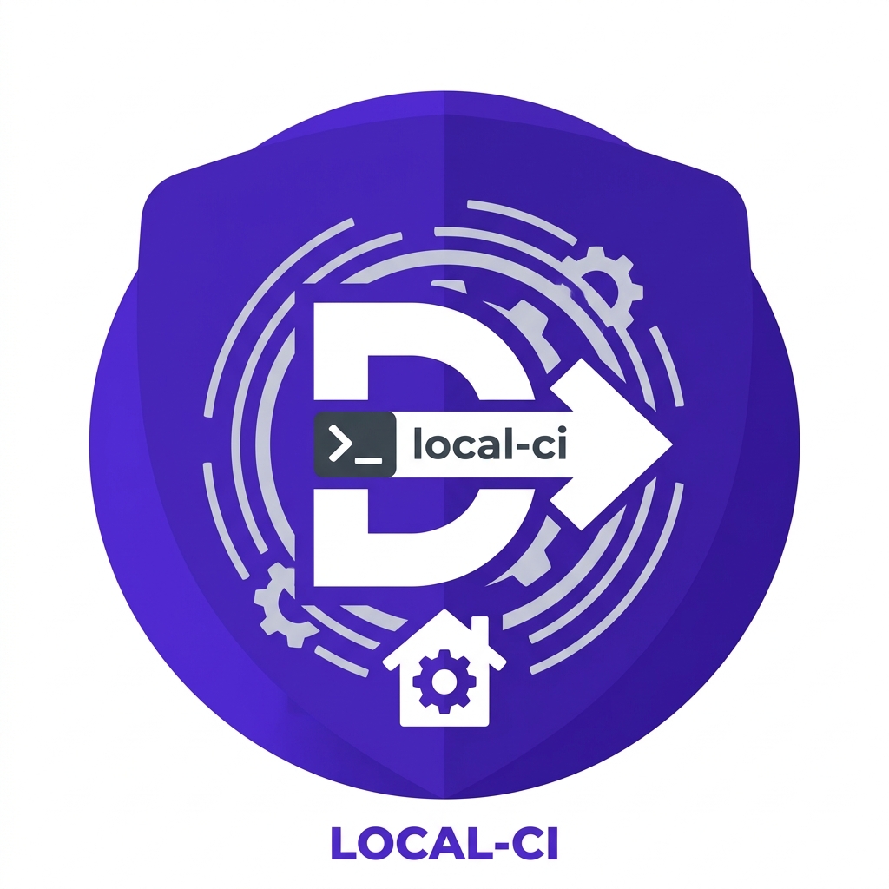
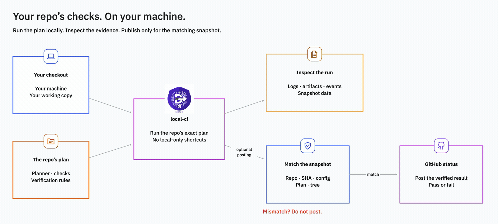

<p align="center">
  
</p>

# local-ci-runner

Shared local CI runner for repo-owned verification steps.

`local-ci` lets a repository define its own verification plan, run that exact
plan on a developer machine, keep the full run artifacts local, and post a
GitHub status only when the verified snapshot still matches the commit being
reported.

## Install

```bash
brew tap DiversioTeam/tap
brew install local-ci
```

Upgrade later with:

```bash
brew update
brew upgrade local-ci
```

<p align="center">
  
</p>

[View the static diagram](./assets/local-ci-overview.png).

## What this is

`local-ci` is the runner, not the checks.

It:
- loads `.local-ci.toml`
- optionally asks a repo-owned planner for a resolved plan
- executes black-box steps
- writes run artifacts under `.local-ci/runs/<run-id>/`
- optionally posts GitHub commit statuses for the verified snapshot

It does **not** know Django, pytest, npm, CircleCI, or any other
consumer-repo-specific workflow.

## Quickstart

Minimal static config:

```toml
version = 1

[github]
enabled = true
aggregate_context = "local/verify"

[[steps]]
id = "test"
command = ["go", "test", "./..."]
```

Run it:

```bash
local-ci run
local-ci runs
local-ci show <run-id>
local-ci logs <run-id>
```

Dirty worktree while iterating:

```bash
local-ci run --no-github
```

SIGINT or SIGTERM stops the active step—including its process group on macOS
and Linux—persists the run as `interrupted`, and lets
`local-ci resume <run-id>` rerun unfinished work.

## Command map

```bash
local-ci run
local-ci resume <run-id>
local-ci runs
local-ci show <run-id>
local-ci logs <run-id>
local-ci logs <run-id> --step <step-id>
local-ci publish <run-id>
local-ci version
local-ci manual
```

## Binary-only discovery and publication evidence

No source checkout is needed to learn the installed version:

```bash
local-ci version
local-ci help version
local-ci manual         # embedded, version-matched reference
local-ci help show
local-ci logs <run-id> --runner --json
```

Help/manual/version and inspection commands do not contact GitHub or check for
updates. Existing runner logs include typed publication request/outcome events
with exact repository/SHA/context and timestamps. There is no separate summary
or inferred publication state. Missing legacy evidence remains unknown.
Receipts describe history, not current GitHub status or checkout validation.

`run`/`resume` execute repo-owned code and may post statuses. `publish` can
execute the planner and posts statuses; it is not inspection or a dry run.
These require separate authorization. See embedded manual section 8.1 for
receipt fields, failure handling, compatibility, and retry boundaries.

## Docs

- `AGENTS.md` — short agent/worktree map
- `docs/README.md` — docs index
- `docs/contracts.md` — `.local-ci.toml`, planner, run artifact, and status contracts
- `docs/architecture.md` — engine/write/read path model
- `docs/inspection.md` — `runs`, `show`, `logs`, `publish`
- `docs/quality/gates.md` — local checks and release CI
- `docs/runbooks/development.md` — contributor loop
- `cmd/local-ci/MANUAL.md` — long-form CLI manual

## Development

```bash
gofmt -w cmd internal
go test ./...
go vet ./...
ruff check .
go build ./cmd/local-ci
go run ./cmd/local-ci --help
go run ./cmd/local-ci manual
```

Use `examples/basic/.local-ci.toml` as the smallest repo config example.

## License

MIT — see [`LICENSE`](./LICENSE).
